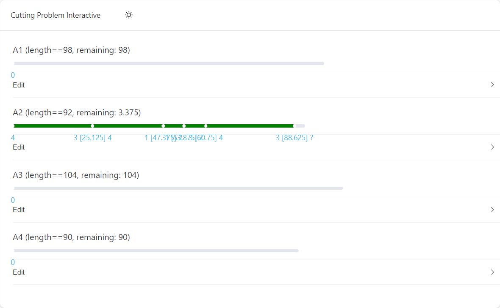

# Baseboard Cutting Problem Interactive

A interactive UI the simulation mitter cutting on baseboard

<details><summary>DEMO</summary>



</details>

## Project setup

```bash
npm install
```

### Compiles and hot-reloads for development

```bash
npm run dev
```

### Compiles and minifies for production

```bash
npm run build
```
